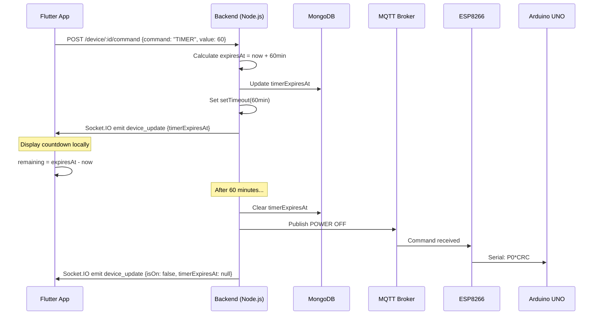

# Design Document - Timer Feature

## Overview

Chức năng hẹn giờ cho phép người dùng đặt thời gian tự động tắt quạt. Hệ thống sử dụng kiến trúc timestamp-based (`expiresAt`) thay vì countdown-based để đảm bảo đồng bộ giữa nhiều thiết bị và khả năng phục hồi khi server restart.

## Architecture



## Components and Interfaces

### Backend Components

#### 1. TimerService (`BE/src/services/timerService.js`)

```javascript
// Interface
class TimerService {
  // Active timers storage: Map<deviceId, { timeoutId, expiresAt }>
  private activeTimers: Map;
  
  // Set a new timer, returns expiresAt timestamp
  setTimer(deviceId: string, minutes: number, callback: Function): Date;
  
  // Cancel an active timer
  cancelTimer(deviceId: string): boolean;
  
  // Get current timer info
  getTimer(deviceId: string): { expiresAt: Date } | null;
  
  // Restore timer from DB (for server restart)
  restoreTimer(deviceId: string, expiresAt: Date, callback: Function): void;
}
```

#### 2. DeviceController Updates (`BE/src/controllers/deviceController.js`)

```javascript
// New command handler
case 'TIMER':
  if (value > 0) {
    const expiresAt = timerService.setTimer(deviceId, value, () => {
      // Callback: Turn off fan when timer expires
      sendCommand(deviceId, 'POWER', 0);
      // Clear timer in DB
      Device.updateOne({ deviceId }, { 'state.reported.timerExpiresAt': null });
      // Emit update
      io.emit('device_update', { timerExpiresAt: null, isOn: false });
    });
    // Save to DB
    Device.updateOne({ deviceId }, { 'state.reported.timerExpiresAt': expiresAt });
  } else {
    timerService.cancelTimer(deviceId);
    Device.updateOne({ deviceId }, { 'state.reported.timerExpiresAt': null });
  }
  break;

case 'POWER':
  if (value == 0) {
    // Cancel timer when manually turning off
    timerService.cancelTimer(deviceId);
    Device.updateOne({ deviceId }, { 'state.reported.timerExpiresAt': null });
  }
  // ... existing power logic
  break;
```

#### 3. Timer Restoration (`BE/src/index.js`)

```javascript
async function restoreActiveTimers() {
  const activeDevices = await Device.find({
    'state.reported.timerExpiresAt': { $gt: new Date() }
  });
  
  activeDevices.forEach(device => {
    const expiresAt = device.state.reported.timerExpiresAt;
    const remainingMs = expiresAt.getTime() - Date.now();
    
    if (remainingMs > 0) {
      timerService.restoreTimer(device.deviceId, expiresAt, () => {
        sendCommand(device.deviceId, 'POWER', 0);
      });
    }
  });
}
```

### Frontend Components

#### 1. FanEntity Updates (`FE/lib/features/smart_fan/domain/entities/fan_entity.dart`)

```dart
class FanEntity {
  // ... existing fields
  final DateTime? timerExpiresAt; // NEW: Timer expiration timestamp
}
```

#### 2. FanState Updates (`FE/lib/models/fan_state.dart`)

```dart
class FanState {
  // ... existing fields
  final DateTime? timerExpiresAt; // NEW
  
  String? get formattedRemainingTime {
    if (timerExpiresAt == null) return null;
    final remaining = timerExpiresAt!.difference(DateTime.now());
    if (remaining.isNegative) return null;
    
    final hours = remaining.inHours.toString().padLeft(2, '0');
    final minutes = (remaining.inMinutes % 60).toString().padLeft(2, '0');
    final seconds = (remaining.inSeconds % 60).toString().padLeft(2, '0');
    return '$hours:$minutes:$seconds';
  }
}
```

#### 3. Timer UI Widget (`FE/lib/widgets/timer_selector.dart`)

```dart
class TimerSelector extends StatelessWidget {
  final DateTime? currentExpiresAt;
  final Function(int minutes) onTimerSet;
  final VoidCallback onTimerCancel;
  
  // Preset options: 30min, 1h, 2h, 4h, 8h
  static const presets = [30, 60, 120, 240, 480];
}
```

## Data Models

### MongoDB Device Schema Update

```javascript
{
  deviceId: String,
  state: {
    reported: {
      isOn: Boolean,
      speed: Number,
      isRotating: Boolean,
      isAuto: Boolean,
      temperature: Number,
      humidity: Number,
      timerExpiresAt: Date,      // NEW
      lastUpdatedAt: Date
    },
    desired: {
      isOn: Boolean,
      speed: Number,
      isRotating: Boolean,
      isAuto: Boolean,
      timerExpiresAt: Date       // NEW
    }
  }
}
```

### API Command Format

```json
// Set timer (60 minutes)
{
  "command": "TIMER",
  "value": 60
}

// Cancel timer
{
  "command": "TIMER",
  "value": 0
}
```

### Socket.IO Event Format

```json
// device_update event
{
  "isOn": true,
  "speed": 2,
  "isRotating": false,
  "isAuto": false,
  "temperature": 28.5,
  "humidity": 65,
  "timerExpiresAt": "2024-01-15T10:30:00.000Z"  // ISO 8601 UTC
}
```

## Correctness Properties

*A property is a characteristic or behavior that should hold true across all valid executions of a system-essentially, a formal statement about what the system should do. Properties serve as the bridge between human-readable specifications and machine-verifiable correctness guarantees.*

### Property 1: Timer expiration calculation
*For any* timer duration in minutes, the calculated `expiresAt` timestamp SHALL equal `currentTime + (duration * 60000)` milliseconds.
**Validates: Requirements 1.1**

### Property 2: Countdown format consistency
*For any* valid `expiresAt` timestamp where `expiresAt > currentTime`, the formatted remaining time SHALL match the pattern `HH:mm:ss` where HH is hours (00-99), mm is minutes (00-59), and ss is seconds (00-59).
**Validates: Requirements 1.2**

### Property 3: Timer cancellation clears state
*For any* active timer, after cancellation, the `timerExpiresAt` value SHALL be `null` in both memory (Map) and database.
**Validates: Requirements 2.1**

### Property 4: Manual power-off cancels timer
*For any* device with an active timer, when the fan is turned off manually (POWER command with value 0), the timer SHALL be cancelled and `timerExpiresAt` SHALL be `null`.
**Validates: Requirements 3.1, 3.2**

### Property 5: Multi-device synchronization
*For any* timer set on a device, all clients connected to that device SHALL receive the same `expiresAt` timestamp, and their locally calculated remaining times SHALL differ by at most 1 second (accounting for network latency).
**Validates: Requirements 4.1, 4.2**

### Property 6: UTC timestamp format
*For any* `timerExpiresAt` value exchanged between frontend and backend, the timestamp SHALL be in ISO 8601 UTC format (ending with 'Z' or '+00:00').
**Validates: Requirements 4.3**

### Property 7: Timer restoration after restart
*For any* device with `timerExpiresAt > currentTime` in the database when the server starts, a `setTimeout` SHALL be created with duration equal to `expiresAt - currentTime`.
**Validates: Requirements 5.1, 5.2**

## Error Handling

### Backend Errors

| Error Case | Handling |
|------------|----------|
| Invalid timer duration (negative or > 24h) | Return 400 Bad Request |
| Device not found | Return 404 Not Found |
| Database update failure | Log error, return 500, do not set timer |
| Timer callback fails | Log error, retry once, then mark timer as failed |

### Frontend Errors

| Error Case | Handling |
|------------|----------|
| Network timeout when setting timer | Show error toast, allow retry |
| Invalid expiresAt from server | Ignore and show no timer |
| Timer already expired when received | Show no timer (remaining <= 0) |

## Testing Strategy

### Unit Tests

1. **TimerService tests**
   - `setTimer` creates correct expiresAt
   - `cancelTimer` clears timeout and map entry
   - `getTimer` returns correct data or null
   - `restoreTimer` creates timeout with correct remaining time

2. **Countdown formatting tests**
   - Format 3661 seconds as "01:01:01"
   - Format 0 seconds as "00:00:00"
   - Handle negative remaining (return null)

3. **DeviceController timer command tests**
   - TIMER command with positive value sets timer
   - TIMER command with 0 cancels timer
   - POWER OFF cancels active timer

### Property-Based Tests

Using **fast-check** (JavaScript) for backend and **dart_quickcheck** or manual property tests for Flutter.

1. **Property 1 test**: Generate random durations (1-1440 minutes), verify expiresAt calculation
2. **Property 2 test**: Generate random timestamps, verify format output
3. **Property 3 test**: Set timer, cancel, verify state is null
4. **Property 4 test**: Set timer, send POWER OFF, verify timer cancelled
5. **Property 6 test**: Generate timestamps, verify ISO 8601 UTC format

### Integration Tests

1. **End-to-end timer flow**
   - Set timer → verify DB updated → wait → verify fan turns off
   
2. **Multi-client sync test**
   - Set timer from client A → verify client B receives same expiresAt

3. **Server restart recovery test**
   - Set timer → restart server → verify timer continues
