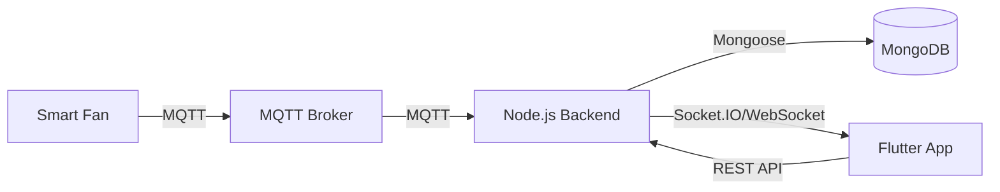

# Báo Cáo Phân Tích Dự Án & Kế Hoạch Chuyển Đổi Công Nghệ (Smart Fan IoT)

## 1. Tổng Quan
Dự án đang trong quá trình chuyển đổi từ kiến trúc **Serverless (Firebase Realtime Database)** sang kiến trúc **Client-Server (Node.js + MongoDB)** tự xây dựng.
- **Frontend (FE)**: Flutter (đang hoạt động với Firebase).
- **Backend (BE)**: Node.js/Express (đang xây dựng, chưa hoàn thiện).
- **Mục tiêu**: Loại bỏ phụ thuộc Firebase, tự chủ hoàn toàn về dữ liệu và logic backend, sử dụng MongoDB.

## 2. Phân Tích Hiện Trạng

### 2.1. Frontend (Flutter)
**Cấu trúc:**
- Sử dụng mô hình **MVVM** cơ bản với `Provider` để quản lý trạng thái.
- Cấu trúc thư mục khá rõ ràng: `screens`, `providers`, `models`, `widgets`.

**Vấn đề tồn tại:**
1.  **Coupling (Sự phụ thuộc) cao**: Class `FanNotifier` (trong `fan_provider.dart`) đang ôm đồm quá nhiều trách nhiệm:
    -   Quản lý trạng thái UI (`isLoading`, `_state`).
    -   Giao tiếp trực tiếp với Firebase (`FirebaseDatabase.instance`).
    -   Xử lý logic nghiệp vụ (parsing dữ liệu, optimistic updates).
    -   Điều này vi phạm nguyên tắc **Single Responsibility Principle (SRP)**.
2.  **Hardcoded Strings**: Các key dữ liệu (`dang_bat`, `nhiet_do`, `che_do`...) được viết cứng (hardcoded) rải rác trong code, dễ gây lỗi khi thay đổi firmware hoặc backend.
3.  **Thiếu lớp Data/Repository**: Không có lớp trung gian để trừu tượng hóa nguồn dữ liệu. Việc chuyển từ Firebase sang Custom Backend sẽ yêu cầu sửa đổi trực tiếp vào `FanNotifier`, rủi ro cao.
4.  **Dependencies**: `pubspec.yaml` hiện tại thiếu khai báo `firebase_core` và `firebase_database` mặc dù code có sử dụng. Có thể do quá trình clean/update chưa đồng bộ.

### 2.2. Backend (Node.js)
**Cấu trúc:**
- Sử dụng mô hình **MVC** (Model-View-Controller).
- Công nghệ: Express, Mongoose, MQTT.js.
- Cấu trúc thư mục `src` (api, config, controllers, models, mqtt) là hợp lý.

**Vấn đề tồn tại:**
1.  **Schema Mismatch (Lệch cấu trúc dữ liệu)**:
    -   FE đang mong đợi các trường như `temperature`, `humidity` (được map từ `nhiet_do`, `do_am` của Firebase).
    -   BE `Device.js` định nghĩa `temp`, `hum`.
    -   Nếu thiết bị gửi `nhiet_do`/`do_am` qua MQTT, BE sẽ không lưu được vào MongoDB do Mongoose Schema mặc định sẽ loại bỏ các trường không định nghĩa (trừ khi set `strict: false` hoặc map lại).
2.  **Thiếu cơ chế Realtime cho FE**:
    -   Hiện tại BE có `mqtt/subscriber.js` để nhận dữ liệu từ thiết bị và lưu DB.
    -   Tuy nhiên, **chưa có cơ chế đẩy dữ liệu này xuống FE** (như Firebase Realtime DB đã làm). FE sẽ không tự cập nhật được giao diện nếu không poll API liên tục (kém hiệu quả).
3.  **Bảo mật**: Đã có thư viện `jsonwebtoken` nhưng chưa thấy middleware xác thực rõ ràng trên các route thiết bị.

## 3. Đề Xuất Kiến Trúc Mới (Clean Architecture)

Để đảm bảo tính mở rộng và dễ bảo trì, chúng ta sẽ áp dụng **Clean Architecture** và **Repository Pattern**.

### 3.1. Kiến Trúc Tổng Thể

### 3.2. Backend (Node.js)
Cần bổ sung/điều chỉnh:
1.  **Socket.IO**: Tích hợp Socket.IO để thay thế tính năng realtime của Firebase. Khi `mqtt/subscriber.js` nhận data mới -> emit sự kiện qua Socket.IO tới FE.
2.  **Data Mapping Layer**: Tạo một lớp mapper để chuyển đổi dữ liệu thô từ MQTT (ví dụ: `nhiet_do`) sang chuẩn của Model (ví dụ: `temperature`).
3.  **API Endpoints**:
    -   `GET /api/devices/:id/state`: Lấy trạng thái hiện tại.
    -   `POST /api/devices/:id/command`: Gửi lệnh điều khiển (BE sẽ publish ngược lại vào MQTT).

### 3.3. Frontend (Flutter)
Cần tái cấu trúc theo các tầng:
1.  **Domain Layer**:
    -   `Entities`: `Fan` (thuần Dart object, không dính JSON/Firebase).
    -   `Repositories (Interface)`: `IFanRepository` (định nghĩa các hàm `getFanState`, `sendCommand`, `streamFanState`).
2.  **Data Layer**:
    -   `Models`: `FanModel` (kế thừa Entity, có hàm `fromJson`, `toJson`).
    -   `DataSources`:
        -   `RemoteDataSource`: Gọi API Node.js (Dio/Http).
        -   `SocketDataSource`: Lắng nghe Socket.IO.
    -   `Repositories (Implementation)`: `FanRepositoryImpl` (triển khai `IFanRepository`, gọi DataSource).
3.  **Presentation Layer**:
    -   `FanProvider` (hoặc Bloc/Cubit): Chỉ gọi `IFanRepository`, không biết data đến từ đâu.

## 4. Kế Hoạch Triển Khai (Step-by-Step)

### Giai đoạn 1: Chuẩn hóa Backend (BE)
1.  **Đồng bộ Schema**: Xác định chính xác JSON mà thiết bị gửi lên. Cập nhật `Device.js` trong BE để khớp hoặc viết hàm map dữ liệu trong `subscriber.js`.
2.  **Tích hợp Socket.IO**:
    -   Cài đặt `socket.io`.
    -   Trong `subscriber.js`, sau khi lưu DB thành công -> `io.emit('device_update', data)`.
3.  **Hoàn thiện API Điều khiển**:
    -   Viết Controller nhận lệnh từ FE -> Publish vào topic MQTT mà thiết bị đang lắng nghe (ví dụ: `fan/{id}/command`).

### Giai đoạn 2: Tái cấu trúc Frontend (FE)
1.  **Tạo lớp Repository**:
    -   Định nghĩa `FanRepository` abstract class.
    -   Tạm thời tạo `FirebaseFanRepository` (giữ code cũ) để đảm bảo app vẫn chạy.
    -   Refactor `FanNotifier` để dùng `FanRepository` thay vì gọi trực tiếp Firebase.
2.  **Xây dựng NodeJsFanRepository**:
    -   Viết class mới implement `FanRepository`.
    -   Dùng `http` để gọi API GET/POST.
    -   Dùng `socket_io_client` để lắng nghe realtime updates.

### Giai đoạn 3: Chuyển đổi (Migration)
1.  Trong `main.dart` hoặc `Dependency Injection` container, đổi việc khởi tạo từ `FirebaseFanRepository` sang `NodeJsFanRepository`.
2.  Test toàn bộ luồng: Bấm nút trên App -> API BE -> MQTT -> Thiết bị -> MQTT -> BE -> Socket.IO -> App cập nhật trạng thái.

## 5. Kết Luận
Dự án có nền tảng tốt nhưng cần tái cấu trúc để tách biệt các thành phần (Decoupling). Việc chuyển đổi sang Backend tự xây dựng là cơ hội tốt để áp dụng Clean Architecture, giúp code dễ đọc, dễ test và dễ mở rộng sau này.
